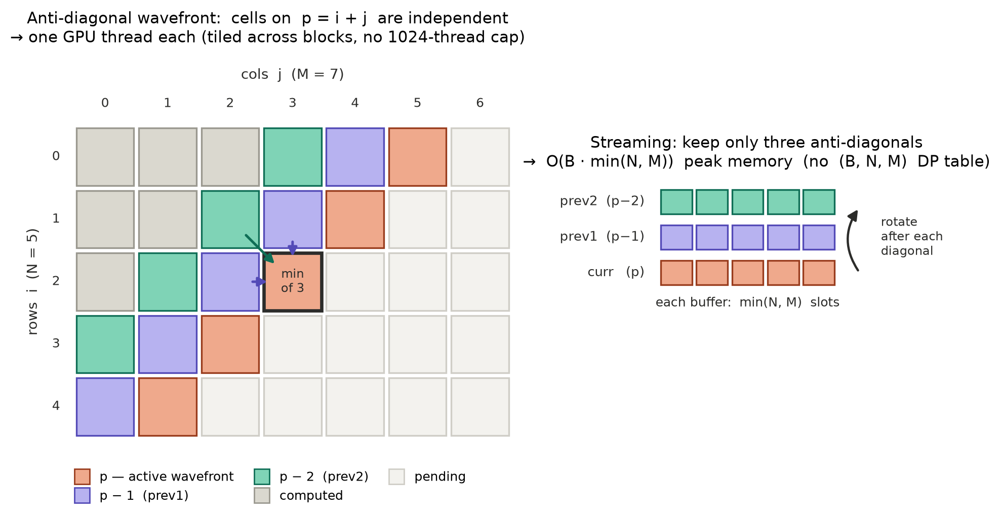

# SoftDTW-CUDA (PyTorch + Numba)

[](https://github.com/nzxyin/sdtw-cuda-torch/actions/workflows/test.yml)
[](LICENSE)
[](https://www.python.org/)

> This is a fork of [BGU-CS-VIL/sdtw-cuda-torch](https://github.com/BGU-CS-VIL/sdtw-cuda-torch)
> maintained by [@nzxyin](https://github.com/nzxyin). Changes from upstream: **variable-length
> padded batch support** (`lens_x`/`lens_y`) for real-world training data such as spectrograms
> (see [Variable-Length Sequences](#variable-length-sequences-spectrograms-asrtts)), and a CUDA
> backend migration from `numba.cuda`/`numba-cuda` to
> [`numba-cuda-mlir`](https://github.com/NVIDIA/numba-cuda-mlir), because plain `numba.cuda`
> breaks on Numba 0.66+ for this repo's kernels. Validated on Python 3.11 through 3.14, see the
> [Compatibility Matrix](#compatibility-matrix).

A **GPU-accelerated, memory-efficient, and numerically stable** implementation of
**Soft Dynamic Time Warping (SoftDTW)** for PyTorch.

This package is designed primarily as a **loss function for training neural networks**, with additional support for **time series averaging** (barycenters). Strong emphasis on:

* 🔥 **GPU memory efficiency**
* 📏 **Long sequence support** (lengths > 1024)
* 🧮 **Numerical stability** (log-space backward)
* ⚡ **Optional fused distance computation** (no `(B,N,M)` tensor)
* 🧩 **Variable-length padded batches** (per-sample `lens_x`/`lens_y`, exact-zero padding gradients)
* 📊 **Time series averaging** (SoftDTW barycenters)

---

## Why This Implementation?

Compared to the popular CUDA implementation by [Maghoumi et al.](https://github.com/mblondel/soft-dtw), this repo fixes critical limitations for real training workloads:

### Feature Comparison

| Feature | Maghoumi CUDA | This Repo |
|---|---|---|
| CUDA forward | ✅ | ✅ |
| CUDA backward | ⚠️ linear-space (overflows at extreme small γ) | ✅ log-space, bounded by construction |
| Max sequence length | ❌ ≤ 1024 | ✅ unbounded (tiled) |
| Efficient batched distance (no `(B,N,M,D)` intermediate) | ❌ broadcasts | ✅ default in both modes |
| Memory-efficient fused mode | ❌ | ✅ |
| Variable-length padded batches | ❌ (fixed length only) | ✅ per-sample `lens_x`/`lens_y` |

### Key Benchmark (B=32, N=512, D=64)

Peak GPU memory, forward + backward (deterministic; regenerate with
[`bench/bench_memory.py`](bench/bench_memory.py)):

| | Maghoumi | Ours (Unfused) | Ours (Fused) |
|---|---|---|---|
| **Peak Memory** | 8,256 MB | 257 MB | 161 MB |
| **vs. Maghoumi memory** | baseline | 96.9% less | 98.0% less |

> **Where the wins come from.** The memory reduction follows from an
> `O(B·N·M)` → `O(B·(N+M))` change: our efficient batched squared-Euclidean distance
> (used in *both* modes) never materializes the `(B, N, M)` cost tensor, and fused mode
> additionally avoids the on-the-fly distance tensor. **Memory** is the headline claim
> and is deterministic; **runtime** is hardware-dependent: unfused is the fast path,
> and fused trades runtime for the lowest peak memory. See the
> [DTW & SoftDTW vs Maghoumi](#dtw--softdtw-vs-maghoumi-rtx-3090) table below for the
> full memory/runtime numbers.
>
> For N > 1024, Maghoumi falls back to CPU; this repo runs N = 2048 and beyond on GPU.
> (An earlier version of this table reported a ~67× speedup; that figure was a near-OOM
> memory-thrashing artifact and is not claimed here.)

### When to Use Each Mode

| Scenario | Mode | Reason |
|---|---|---|
| Long sequences, small `D` | Fused | Lowest peak memory, and the per-cell cost loop is cheap at small `D` |
| **Large `D`** (e.g. foundation features, `D ≳ 64`) | **Unfused** | Fused recomputes the cost with an `O(D)` loop **per DP cell**, so it slows sharply as `D` grows; the unfused cost-matrix (one `bmm`) is far faster |
| Memory-bound (unfused won't fit) | Fused | Avoids even the `(B, N, M)` cost tensor when the cost matrix itself won't fit |
| Speed-critical / inference | Unfused | The fast path: `bmm` cost + tiled DP |
| N > 1024 | Both modes | Both tile the anti-diagonal; fused saves more memory |

### Limitations

* Fused mode requires **CUDA** and **squared Euclidean distance only**
* Fused recomputes the local cost with a serial `O(D)` loop **per DP cell**, so it is slower than unfused and the gap **grows with `D`**. At large `D` (e.g. 768–1024-dim foundation features) prefer `fused=False`: the unfused cost-matrix path builds the distance with a single `bmm`, runs the same DP, gives identical results, and is far faster. Fused's advantage is **memory**, best realized at long `N` with small `D`.
* Our tiled DP kernel is not itself faster than Maghoumi's at a matched distance: the value of our kernels is capability (N > 1024, fusion) and the efficient batched distance, not a faster DP inner loop
* CPU implementation is for testing only, not performance

---

## Installation

### Requirements

* Python 3.11+
* NVIDIA GPU, Compute Capability 7.0+ (Volta or newer), with a matching driver
* PyTorch with CUDA support (see below)
* Numba 0.60+ for the CPU fallback path only. CUDA kernels use
  [`numba-cuda-mlir`](https://github.com/NVIDIA/numba-cuda-mlir) instead of `numba.cuda`; see
  its [own requirements](https://github.com/NVIDIA/numba-cuda-mlir#installation-requirements)
  for full driver and toolkit details, and the Compatibility Matrix below for why.

### Compatibility Matrix

This fork's CUDA kernels use [`numba-cuda-mlir`](https://github.com/NVIDIA/numba-cuda-mlir)
instead of `numba.cuda`/`numba-cuda` (see "Why `numba-cuda-mlir`?" below). Plain `numba` is
still a dependency, used only for the CPU fallback path. Every row below was run through this
repo's own 45-item pytest suite on a real GPU, not inferred from release notes or vendor claims.

Each Python version is paired with the current latest Numba and PyTorch release, confirmed via
each project's own wheel index to actually have a build for that Python version:

| Python | Numba | PyTorch | numba-cuda-mlir | Result |
|---|---|---|---|---|
| **3.11** | 0.67.0 | 2.14.0+cu130 | 0.5.1 | 40 passed, 5 skipped |
| **3.12** | 0.67.0 | 2.14.0+cu130 | 0.5.1 | 40 passed, 5 skipped |
| **3.13** | 0.67.0 | 2.14.0+cu130 | 0.5.1 | 40 passed, 5 skipped |
| **3.14** | 0.67.0 | 2.14.0+cu130 | 0.5.1 | 40 passed, 5 skipped |

Python 3.10 is no longer supported (`numba-cuda-mlir` requires 3.11+). PyTorch 2.14.0's `cu132`
build (CUDA 13.2) also passes the full suite.

Also validated, from before the `numba-cuda-mlir` migration: Numba 0.65.1 with the old
`numba.cuda` in-tree target, Python 3.13, PyTorch 2.13.0+cu130, CUDA 13.0: 40/40 passed.

Compatibility beyond the combinations above is not guaranteed.

### Why `numba-cuda-mlir`?

This fork originally used `numba.cuda` directly. Testing Numba 0.67.0 (the latest release)
surfaced three separate upstream bugs that break this repo's kernels on Numba 0.66+:

1. The in-tree CUDA target hits [numba/numba#10753](https://github.com/numba/numba/issues/10753),
   an open regression in two-argument `max()`/`min()`, which this repo's kernels use throughout.
2. Installing `numba-cuda` (the usual fix) instead hits
   [NVIDIA/numba-cuda#907](https://github.com/NVIDIA/numba-cuda/issues/907): it still
   references `np.row_stack`, removed in NumPy 2.5.
3. Working around that with `numpy<2.5` then fails on a missing `libdevice` file, which
   `numba-cuda`'s pathfinder cannot locate in this setup.

`numba-cuda-mlir` avoids all three: it does not depend on `numba` or `numba-cuda` at all. The
migration was two import lines (`from numba import cuda` to `from numba_cuda_mlir import
cuda`), a Python floor bump to 3.11, and a new dependency. Full details on
[#2](https://github.com/nzxyin/sdtw-cuda-torch/issues/2).

### Step 1: Install PyTorch with CUDA

PyTorch must be installed **before** this package, with the correct CUDA variant for your system. See [pytorch.org/get-started](https://pytorch.org/get-started/locally/) for the right command. Example for CUDA 13.0 (the combination validated for this fork):

```bash
pip install torch --index-url https://download.pytorch.org/whl/cu130
```

### Step 2: Install this package with the matching CUDA extra

This package's CUDA kernels depend on
[`numba-cuda-mlir`](https://github.com/NVIDIA/numba-cuda-mlir), which needs to know whether to
pull CUDA 12.x or 13.x toolkit components. Pick the extra matching the CUDA variant you
installed PyTorch with in Step 1:

```bash
git clone https://github.com/nzxyin/sdtw-cuda-torch
pip install -e "sdtw-cuda-torch[cu13]"   # or "[cu12]" for CUDA 12.x
```

---

## Usage

### Basic (Unfused)

```python
from softdtw_cuda import SoftDTW

loss_fn = SoftDTW(gamma=1.0)

x = torch.randn(B, N, D, device="cuda", requires_grad=True)
y = torch.randn(B, M, D, device="cuda", requires_grad=True)

loss = loss_fn(x, y).mean()
loss.backward()
```

* Explicit distance computation
* More flexible
* Higher memory usage

---

### Fused Mode (Recommended for Training)

```python
loss_fn = SoftDTW(
    gamma=1.0,
    dist="sqeuclidean",
    fused=True
)

loss = loss_fn(x, y).mean()
loss.backward()
```

**Fused mode**

* No `(B, N, M)` distance tensor → much lower GPU memory
* Best for **long `N` at small `D`**
* ⚠️ Recomputes the cost `O(D)` per DP cell; at **large `D`** use `fused=False` (faster; see [When to Use Each Mode](#when-to-use-each-mode))

---

## Anti-diagonal wavefront

Every CUDA path here, fused and unfused **SoftDTW** and exact **DTW**, evaluates the DP
along **anti-diagonals**. Cells on diagonal `p = i + j` depend only on diagonals `p − 1` and
`p − 2`, so a whole diagonal is independent and runs in parallel, one GPU thread per cell,
**tiled across blocks**. That tiling removes the one-block-per-sequence **1024-thread cap** of
prior CUDA implementations, so sequences of any length run on the GPU.



*Left: cells on `p = i + j` are independent → one thread each (no 1024-thread cap). Right:
the forward-only DTW kernel keeps only three rolling buffers of length `min(N, M)`.
Regenerate with* [`docs/make_antidiag_figure.py`](docs/make_antidiag_figure.py).

The **three-buffer streaming** (figure, right) is specific to exact **DTW**, which is
forward-only and so never needs the full table, giving `O(B·min(N, M))` peak memory. Fused
**SoftDTW** uses the same wavefront but retains the `(B, N+2, M+2)` table for its log-space
backward; its memory win comes from not materializing the `(B, N, M)` *cost* tensor, not
from streaming the table.

---

## Exact DTW (hard-DTW)

For evaluation and retrieval you often want the **exact** DTW distance rather than a
smoothed loss. `DTW` is the `γ → 0` limit of `SoftDTW`: a true `min` recurrence, with no
`gamma` and no `exp`/`log`. It runs on the same [anti-diagonal wavefront](#anti-diagonal-wavefront),
and in **fused** mode streams the DP over three rolling diagonals → `O(B·min(N, M))` peak
memory (the unfused path materializes the `(B, N, M)` cost matrix).

```python
from softdtw_cuda import DTW, dtw

d = DTW(dist="sqeuclidean")           # nn.Module
cost = d(x, y)                        # (B,), forward-only (no autograd graph)

cost = dtw(x, y, dist="sqeuclidean")  # functional alias
```

* **Forward-only:** hard-DTW is non-differentiable at the optimal path, so `DTW` runs
  under `torch.no_grad()`. Use `SoftDTW` when you need gradients.
* Intended for **1-NN-DTW** classification/retrieval. On L2-normalized inputs,
  squared-Euclidean `= 2(1 − cosine)`, so `DTW(dist="sqeuclidean")` reproduces cosine-DTW
  up to a positive affine factor (argmin-invariant), i.e. exact cosine 1-NN-DTW.
* Supports the same `fused` and `bandwidth` options as `SoftDTW`. For **1-NN-DTW on
  high-dimensional features** (e.g. foundation-model embeddings, `D` in the hundreds), use
  `fused=False`: the cost-matrix path is far faster than fused's per-cell `O(D)` loop, and
  chunk the candidate pairs to bound the `(pairs, N, M)` cost tensor.
* Also supports per-sample `lens_x`/`lens_y` (see
  [Variable-Length Sequences](#variable-length-batches-padding-support) below), in every mode
  (fused / unfused, CUDA / CPU). Since `DTW` has no backward pass, only the forward distance is
  affected: padding frames never enter the alignment.

---

### Variable-Length Batches (Padding Support)

Real batches rarely share one sequence length. Pass per-sample lengths and
padding frames never enter the alignment: the DP recurrence stops at each
sample's own true length, and per-sample results are read from each sample's
own final DP cell. Both `SoftDTW` and `DTW` accept `lens_x`/`lens_y`; for
`SoftDTW`, **padding frames also receive exactly-zero gradients**:

```python
loss_fn = SoftDTW(gamma=1.0)

x = torch.randn(B, N, D, device="cuda", requires_grad=True)  # padded
y = torch.randn(B, M, D, device="cuda")                      # padded
lens_x = torch.tensor([...])  # (B,) true lengths, 1 <= lens_x[b] <= N
lens_y = torch.tensor([...])  # (B,) true lengths, 1 <= lens_y[b] <= M

loss = loss_fn(x, y, lens_x=lens_x, lens_y=lens_y).mean()
loss.backward()

# DTW is forward-only (no backward pass), same lens_x/lens_y:
cost = DTW(dist="sqeuclidean")(x, y, lens_x=lens_x, lens_y=lens_y)
```

* Works in every mode: fused / unfused, CUDA / CPU; for `SoftDTW`, also
  `normalize=True` / `False`
* Equivalent to (but much faster than) a Python loop of per-sample sliced
  batch-1 calls; batch parallelism is preserved on the GPU
* With `SoftDTW(normalize=True)`, the padded dims must still match (`N == M`),
  but per-sample `lens_x[b]`/`lens_y[b]` may differ
* Omitting the lengths keeps the classic fixed-length behavior

---
# Applications
## Forecasting


Train a simple forecaster using SoftDTW as the loss function:

```python
import torch
from softdtw_cuda import SoftDTW

model = MyForecaster().cuda()
optimizer = torch.optim.Adam(model.parameters(), lr=0.01)
loss_fn = SoftDTW(gamma=1.0, fused=True)

for x_batch, y_batch in dataloader:
    y_pred = model(x_batch.cuda())           # (B, N, D)
    loss = loss_fn(y_pred, y_batch.cuda()).mean()

    optimizer.zero_grad()
    loss.backward()
    optimizer.step()
```

See [examples/forecasting_example.py](examples/forecasting_example.py) for a complete working example with sine wave data.


## Variable-Length Sequences (Spectrograms, ASR/TTS)

Speech and audio batches almost never share one frame count. Spectrograms,
mel-features, and other frame-rate time series have a different true length
per utterance and get zero-padded to the batch's longest sample. Pass
`lens_x`/`lens_y` so the padding never enters the alignment or the gradient,
which keeps the batched call numerically identical to looping over unpadded
per-sample calls:

```python
from softdtw_cuda import SoftDTW

model = MySpectrogramModel().cuda()
optimizer = torch.optim.Adam(model.parameters(), lr=1e-3)
loss_fn = SoftDTW(gamma=0.5, fused=True)

for specs, targets, lengths in dataloader:  # specs/targets: (B, T_max, n_mels), padded
    pred = model(specs.cuda())              # (B, T_max, n_mels)
    loss = loss_fn(pred, targets.cuda(), lens_x=lengths.cuda(), lens_y=lengths.cuda()).mean()

    optimizer.zero_grad()
    loss.backward()
    optimizer.step()
```

See [examples/variable_length_spectrogram_example.py](examples/variable_length_spectrogram_example.py) for a complete working example that trains a denoiser on synthetic variable-length spectrograms and verifies the padded-batch loss exactly matches a per-sample loop.


## Time Series Barycenters (Averaging)


Compute a DTW-space average (barycenter) for a batch of sequences:

```python
from softdtw_cuda import softdtw_barycenter

sequences = torch.randn(10, 100, 3, device="cuda")  # 10 sequences

barycenter = softdtw_barycenter(
    sequences,
    gamma=1.0,
    max_iter=100,
    lr=0.1,
)

print(barycenter.shape)  # (100, 3)
```

**Key options:**

* `gamma`: Regularization strength (higher = smoother)
* `max_iter`: Optimization iterations
* `lr`: Adam learning rate (0.1 default)
* `fused`: Auto-select fused mode (memory vs speed trade-off)
* `early_stopping=True`: Detects convergence, saves ~30-50% iterations

See [BARYCENTERS.md](softdtw_cuda/BARYCENTERS.md) for detailed docs and [examples/barycenter_example.py](examples/barycenter_example.py) for visualization.

### Classic DBA (exact-DTW averaging)

For a non-differentiable, hyperparameter-free alternative, `dtw_barycenter` implements
classic **DTW Barycenter Averaging** (Petitjean et al., 2011) under *exact* DTW. It
alternates hard-DTW alignment of every series to the current barycenter with a per-index
weighted mean, monotonically decreasing the total DTW cost, with no learning rate and no `gamma`.

```python
from softdtw_cuda import dtw_barycenter

sequences = torch.randn(10, 100, 3, device="cuda")
bary = dtw_barycenter(sequences, max_iter=30)   # (100, 3)
```

Local-cost matrices are computed with torch (GPU-capable); the sequential DP + backtrack
runs in a numba-jitted CPU loop. Use `softdtw_barycenter` for a smooth, differentiable
barycenter; use `dtw_barycenter` for the classic hard-alignment average with no tuning.

---

## Normalization

Supports the common normalized variant:

$$\mathrm{SoftDTW\_norm}(x,y) = \mathrm{SoftDTW}(x,y) - \tfrac{1}{2}\bigl(\mathrm{SoftDTW}(x,x) + \mathrm{SoftDTW}(y,y)\bigr)$$

Enable with:

```python
SoftDTW(normalize=True)
```

⚠️ **Current constraint:** normalization requires equal sequence lengths
`x.shape == y.shape == (B, N, D)`

---

## Notes

* SoftDTW **may return negative values** (expected)
* Squared Euclidean distances are always ≥ 0
* Negativity arises from the soft-min aggregation

---

## Tests

```bash
pytest -v
```

| Test file | What it covers |
|---|---|
| `test_softdtw_small.py` | CPU and CUDA forward/backward, gradient correctness |
| `test_softdtw_long.py` | Sequences longer than 1024 (tiled kernel) |
| `test_softdtw_log_backward.py` | Log-space backward numerical stability |
| `test_fused_sqeuclid.py` | Fused vs unfused equivalence for squared Euclidean |
| `test_sqeuclidean.py` | Distance computation correctness |
| `test_gradcheck.py` | `torch.autograd.gradcheck` (float64) across edge shapes, fused and unfused |
| `test_reference_agreement.py` | Forward/backward vs independent references (tslearn + a naive NumPy DP) |
| `test_dtw.py` | Exact hard-DTW vs a reference DP; fused/unfused/CPU parity |
| `test_dba.py` | Classic DBA barycenter (monotone cost, weighting, shapes) |
| `test_cuda_bandwidth_regression.py` | Regression: finite gradients under a Sakoe–Chiba bandwidth |
| `test_validation.py` | Input validation: gamma, device, empty sequences, shape mismatches |
| `test_lengths.py` | Variable-length padded batches (`lens_x`/`lens_y`): batched-vs-per-sample equivalence, exact-zero padding gradients, tiled-path lengths, gradcheck |
| `test_dtw_lengths.py` | Variable-length padded batches on the exact-DTW path: batched-vs-per-sample equivalence, `N>M` buffer swap with unequal lengths, fused/unfused/CPU agreement, long sequences |

---

## Benchmarking

The memory/runtime benchmark lives in `bench/`. [`bench/bench_memory.py`](bench/bench_memory.py)
compares peak GPU memory and runtime of Maghoumi's CUDA SoftDTW against our unfused and fused
modes across a grid of `(B, N, D)`, writing `bench/softdtw_memory_benchmark.csv` and
`bench/benchmark_plots.pdf`.

Key results:

**SoftDTW loss function**
* Peak-memory reduction of **91–98%** vs. Maghoumi et al. (deterministic)
* Runs arbitrary sequence lengths on GPU (no 1024 cap); Maghoumi falls back to CPU for N > 1024
* Numerically stable via a log-space backward pass

**Barycenters**
* `softdtw_barycenter`: Adam + cosine annealing + early stopping (typically saves 30–50% of iterations); fused or unfused
* `dtw_barycenter`: classic DBA under exact DTW, monotone cost, no tuning

### DTW & SoftDTW vs Maghoumi (RTX 3090)

Peak GPU memory (MB), `γ=1.0`. SoftDTW is timed forward+backward (loss usage); exact
DTW is forward-only. Maghoumi implements SoftDTW only, and only on GPU for
`max(N, M) ≤ 1024`; N/A past that cap, and OOM at `B=32, N=1024, D=64`.

| B | N | D | SoftDTW Maghoumi | SoftDTW unfused | SoftDTW fused | DTW unfused | DTW fused |
|--:|--:|--:|--:|--:|--:|--:|--:|
| 16 | 256 | 64 | 1031 | 48 | 35 | 34 | **18** |
| 16 | 1024 | 64 | 16476 | 477 | 285 | 280 | **24** |
| 16 | 2048 | 64 | N/A | 1834 | 1066 | 1056 | **33** |
| 16 | 4096 | 64 | N/A | 7240 | 4166 | 4145 | **49** |
| 16 | 512 | 128 | 8236 | 141 | 93 | 88 | **24** |
| 32 | 1024 | 64 | OOM (~32 GB) | 938 | 554 | 544 | **33** |

* **Exact DTW (fused)** streams three anti-diagonals, so peak memory stays flat at
  `O(B·min(N, M))` (**18 → 49 MB as N grows 256 → 4096**), versus DTW-unfused's
  materialized `(B, N, M)` tensor (34 → 4145 MB).
* **Fused SoftDTW** cuts peak memory ~97–98% vs Maghoumi and keeps running past
  N=1024, where Maghoumi leaves the GPU (and OOMs at `B=32, N=1024, D=64`).
* **Runtime:** unfused SoftDTW is the fast path, ~1.4–1.7× faster than Maghoumi where
  it runs (N=1024, D=64: 68 vs 115 ms). The fused paths trade runtime for memory
  (per-diagonal launches under-utilize the GPU at small `min(N, M)`), so reach for
  them when memory-bound.

Regenerate this table with [`bench/bench_dtw_sdtw.py`](bench/bench_dtw_sdtw.py) (RTX 3090;
also writes the full runtime table to `bench/bench_dtw_sdtw_table.md`). A softdba-vs-classic-DBA
barycenter analysis is in [`bench/bench_barycenter_analysis.py`](bench/bench_barycenter_analysis.py)
→ [results](bench/bench_barycenter_analysis_table.md).

Run with:
```bash
python bench/bench_memory.py               # memory/runtime comparison vs Maghoumi (needs a GPU)
python bench/bench_dtw_sdtw.py             # DTW/SoftDTW fused/unfused vs Maghoumi strengths table
python bench/bench_barycenter_analysis.py  # softdba vs classic DBA analysis
python examples/barycenter_example.py --compare
```

---

## Acknowledgments

**SoftDTW Loss:**
> Cuturi & Blondel,
> *Soft-DTW: a Differentiable Loss Function for Time-Series*, ICML 2017

**SoftDTW Barycenter:**
> Based on [tslearn](https://github.com/tslearn-team/tslearn) implementation, originally from Cuturi & Blondel (ICML 2017)

**Classic DBA (`dtw_barycenter`):**
> Petitjean, Ketterlin & Gançarski,
> *A global averaging method for dynamic time warping, with applications to clustering*,
> Pattern Recognition, 2011

**Prior PyTorch/CUDA implementations this work builds on:**
* [Sleepwalking/pytorch-softdtw](https://github.com/Sleepwalking/pytorch-softdtw): PyTorch GPU implementation
* [Maghoumi/pytorch-softdtw-cuda](https://github.com/Maghoumi/pytorch-softdtw-cuda): CUDA implementation (motivation for memory and stability improvements)
* [keonlee9420/Soft-DTW-Loss](https://github.com/keonlee9420/Soft-DTW-Loss): additional PyTorch reference implementation

---

## License

MIT

